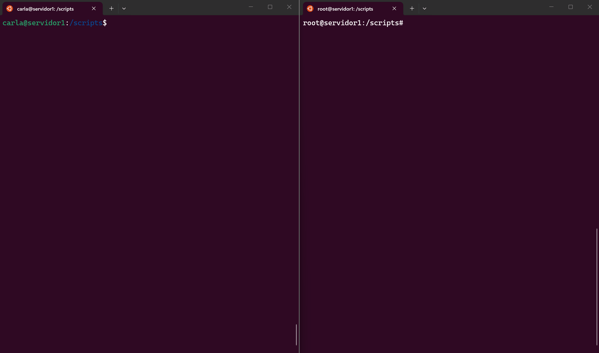
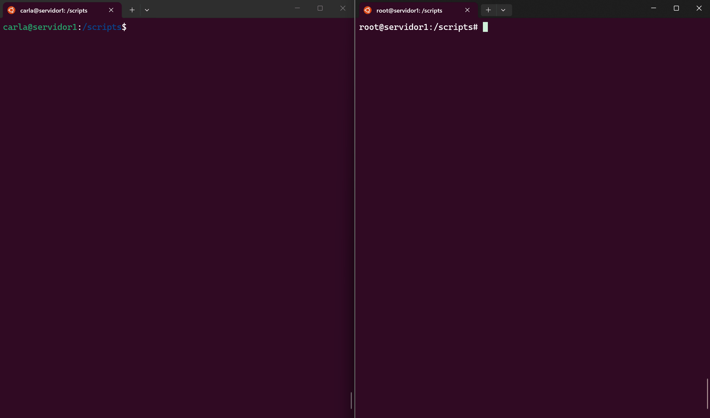
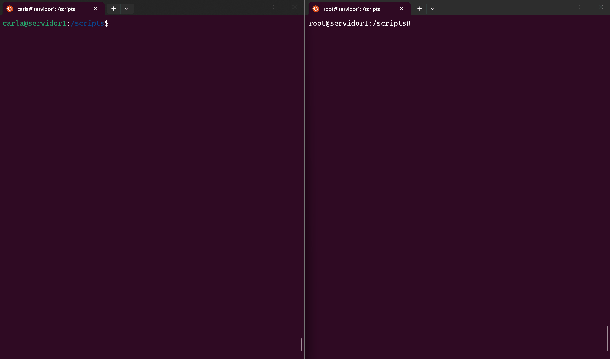

# Linux Fundamentals - DIO

 

Este repositório é destinado à publicação dos scripts e soluções desenvolvidos para os desafios do curso **"Linux Fundamentals"** da **Digital Innovation One (DIO)**.

O objetivo é documentar a evolução do aprendizado em administração de sistemas Linux, focando em automação, gerenciamento de usuários e permissões.

---

# 🛠️ Ferramentas Utilizadas
- Sistema Operacional: Ubuntu (via WSL2)
- Linguagem: Shell Script (Bash)
- Gravação de Demonstração: [ScreenToGif](https://www.screentogif.com/)

---

# Estrutura do Repositório

## [Infraestrutura como Código (IaC): Script de Criação de Estrutura de Usuários, Diretórios e Permissões](./01-desafio)
Contém a solução para o desafio de **Infraestrutura como Código (IaC): Script de Criação de Estrutura de Usuários, Diretórios e Permissões**.
- Automação de criação de usuários, grupos e diretórios.
- Gerenciamento de permissões e segurança.
- Scripts de validação e auditoria.

### Demonstração em Tempo Real

> Demonstração foi gravada com ScreenToGif.

- Falha ao executar o script `iac.sh` com um usuários sem ser o `root` e sem utilizar o comando `sudo`:
    

- Falha ao tentar criar os usuários sem ter o arquivo `usuarios.txt`:
    

- Criação de diretórios, grupos de permissão e usuários:
    

- Remoção de diretórios, grupos de permissão e usuários:
    

---

# 🤝 Contribuindo

Este repositório tem como foco o estudo e a prática de administração de sistemas Linux.

- **Melhorias:** Encontrou um bug, otimizou um script ou tem uma nova ideia? Sinta-se à vontade para abrir um Pull Request. Sua contribuição ajuda a comunidade a evoluir.

Juntos construímos uma comunidade de aprendizado prático e acessível. 🚀

---
*Projeto desenvolvido para fins educacionais.*